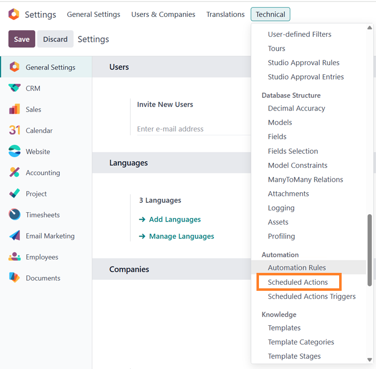
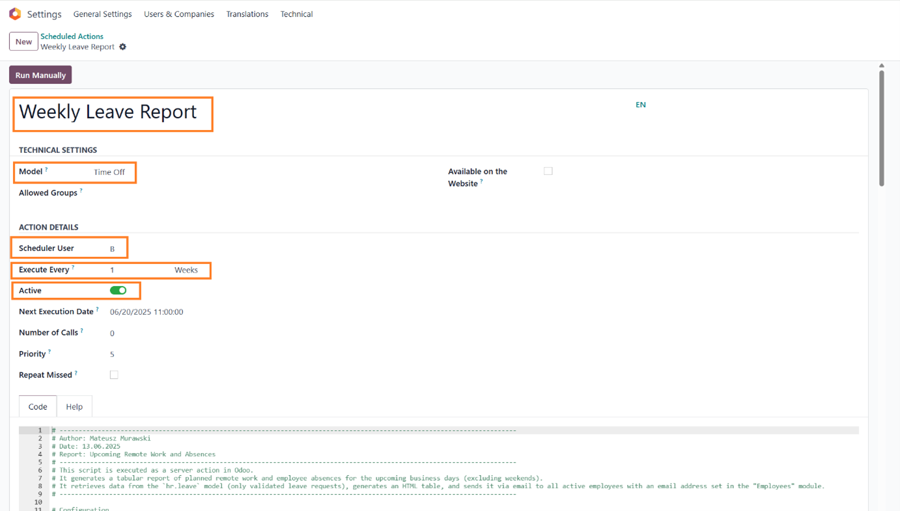
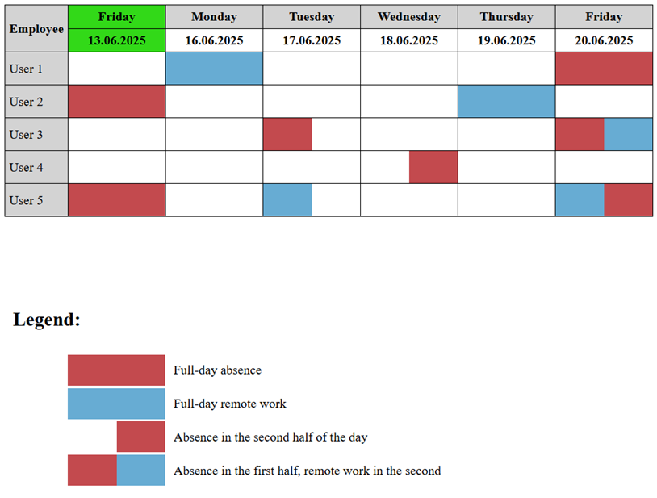

# 🗓️ Weekly Leave Report Script

This script generates a **weekly report of planned remote work and employee absences** in the company. The report is formatted as an HTML table and is automatically sent via email to all active employees with a valid email address.

## 🧩 Context

In the target company, we distinguish between two main types of time off:
- **Remote Work** (e.g., home office)
- **Absences** (e.g., sick leave, paid vacation)

Additionally, in our Odoo environment, it is possible to take **a half day off** (AM or PM), and this case is also handled properly in the report.

---

## 📋 How to Use

To activate the script in Odoo:

1. **Enable Developer Mode** in your Odoo instance.
2. Navigate to:  
   `Settings` → `Technical` → `Automation` → `Scheduled Actions`

   

3. Click **New** and configure the fields as follows:

   - **Name**: `Weekly Leave Report`
   - **Model**: `Time Off`
   - **Execute Every**: `1 week`
   - **Scheduler User**: select any administrator user
   - **Active**: ✅ enabled
   - Paste the script into the **Python Code** section

   

---

## 📨 What Does the Email Include?

- A table listing employees and their time off status for each weekday (Mon–Fri)
- Color-coded indicators:
  - 🟥 – absence
  - 🟦 – remote work
- Half-day leaves (AM/PM) are clearly marked
- A legend is included below the table

---

## 🖼️ Appearance of the Report

Below is an example of the generated report sent via email:

---

## 🧪 Technical Information

- Script tested in **Odoo 17 SaaS**
- Uses the `hr.leave` model (validated leave requests only)
- Ignores weekends
- Only includes employees with assigned email addresses
